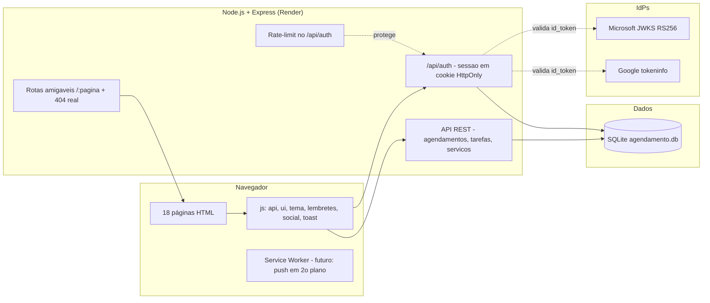
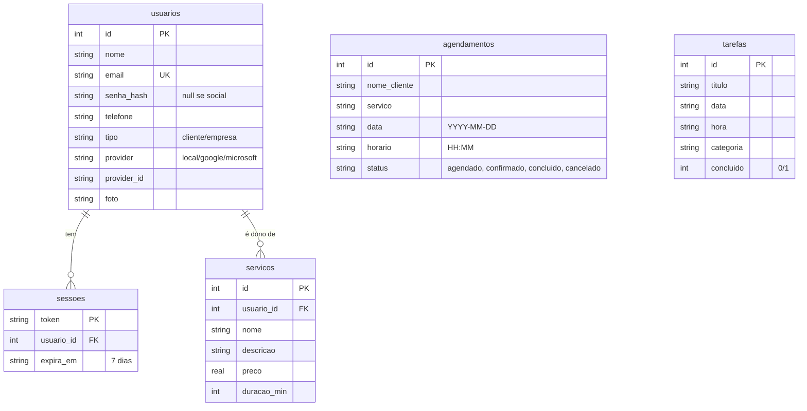
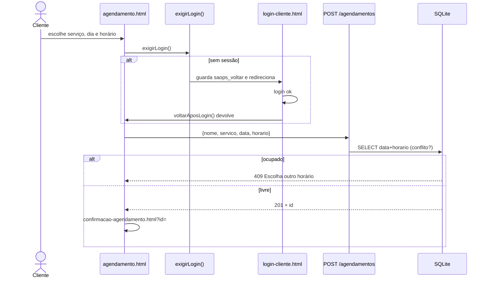
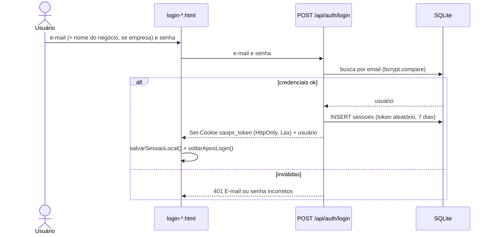
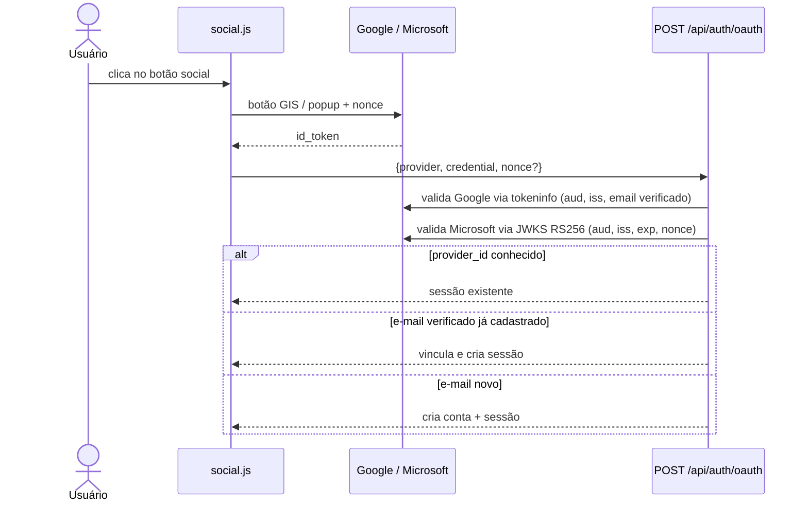
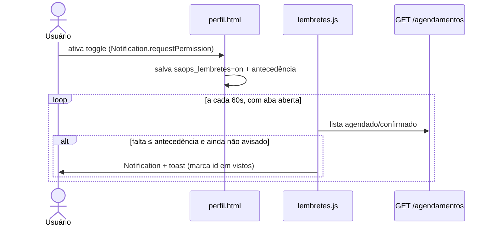
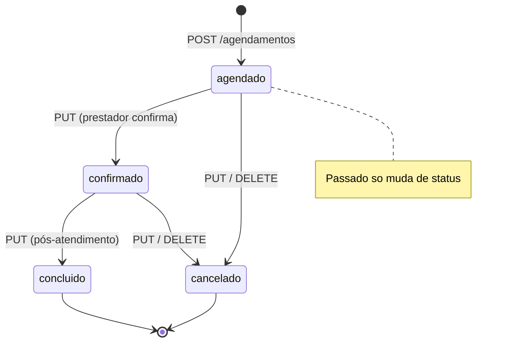
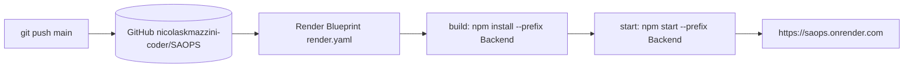
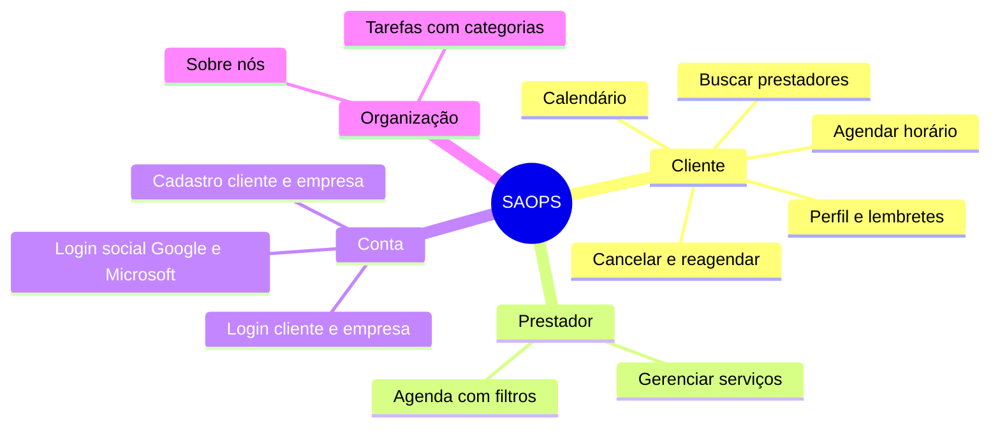

# 📊 Diagramas do SAOPS

Arquitetura, banco de dados e fluxos do sistema em [Mermaid](https://mermaid.js.org/) (renderizam direto no GitHub).

---

## 1. Arquitetura

---

## 2. Banco de dados

> Índices: `UNIQUE(data, horario)` em agendamentos (anti double-booking) + índices em `sessoes(expira_em, usuario_id)`. `agendamentos` e `tarefas` são globais (sem dono) — herança do TCC.

---

## 3. Agendar horário (com login)

---

## 4. Login local + sessão

---

## 5. Login social (Google / Microsoft)

---

## 6. Lembretes de agendamento

> Push em 2º plano (aba fechada) é o próximo passo: Service Worker + Web Push + scheduler no servidor.

---

## 7. Status do agendamento

---

## 8. Deploy

---

## 9. Mapa das páginas

---

*Gerado a partir do código em `Backend/` e `Frontend/` — se o código mudar, atualize os diagramas.*
